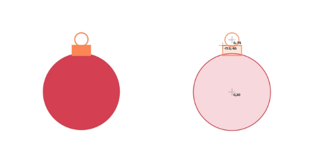

# NOTES

## Research further: 
- [ ] console commands in depth
- [ ] git ignore files
- [ ] what chmod stands for
- [ ] common html attributes
- [ ] clean up/summarize copied things


## Random things: 

### SSH into your server
`➜  ssh -i [key pair file] ubuntu@[ip address or your domain name]`  
`exit` to exit the shell

### Chmod commands
Order: User, Group, Everyone  

| Numbers |  Notation |  Permissions  | 
| ------- | --------- | ------------- | 
|    0    |    ---    |     None      | 
|    1    |    --x    |    Execute    |  
|    2    |    -w-    |     Write     |  
|    3    |    -wx    | Write/Execute | 
|    4    |    r--    |      Read     | 
|    5    |    r-x    | Read/Execute  |  
|    6    |    rw-    |   Read/Write  |  
|    7    |    rwx    |Read/Write/Exec| 

### Keyboard shortcut to select multiple lines to edit in VS Code
`alt` and select    

# The Console

📖 **Deeper dive reading**: [MDN Command line crash course](https://developer.mozilla.org/en-US/docs/Learn/Tools_and_testing/Understanding_client-side_tools/Command_line)

## Common commands
- **pwd** - Check present working directory
- **echo** - Output the parameters of the command
- **cd** - Change directory
- **mkdir** - Make directory
- **rmdir** - Remove directory
- **rm** - Remove file(s)
- **mv** - Move file(s)
- **cp** - Copy files
- **ls** - List files
- **ls -la** - List all files in long format (hidden ones that start with .)
- **curl** - Command line client URL browser
- **grep** - Regular expression search
- **find** - Find files
- **top** - View running processes with CPU and memory usage
- **df** - View disk statistics
- **cat** - Output the contents of a file
- **less** - Interactively output the contents of a file
- **wc** - Count the words in a file
- **ps** - View the currently running processes
- **kill** - Kill a currently running process
- **sudo** - Execute a command as a super user (admin)
- **ssh** - Create a secure shell on a remote computer
- **scp** - Securely copy files to a remote computer
- **history** - Show the history of commands
- **ping** - Check if a website is up
- **tracert** - Trace the connections to a website
- **dig** - Show the DNS information for a domain
- **man** - Look up a command in the manual
- **touch** - Creates a new empty file in the current directory (or update the timestamp if it does exist)

You can also chain the input and output of commands using special characters

- `|` - Take the output from the command on the left and _pipe_, or pass, it to the command on the right
- `>` - Redirect output to a file. Overwrites the file if it exists
- `>>` - Redirect output to a file. Appends if the file exists

For example, you can list the files in a directory, pipe it into `grep` to search for files created in Nov, and then pipe that into `wc` to count the number of files found with a date of Nov.

```
ls -l | grep ' Nov ' | wc -l
```

There are also keystrokes that have special meaning in the console.

- `CTRL-R` - Use type ahead to find previous commands
- `CTRL-C` - Kill the currently running command

## How to edit a file from the command line
1. Open the file using the vi or vim command:  
`vi example_file`
2. Press the `i` key to enter insert mode.  
3. Make your desired changes. Note that you can use the arrow keys to move around in the file.  
4. Press the escape `ESC` key to exit insert mode.   
5. Type `:w` and press the enter key to save your changes.  
6. Type `:q` and press the enter key to close the file. (Optionally, type `:wq` to save and close the file, or `:q!` to close without saving)

# Git

## Git Commands

Check your git version
```sh
➜  git --version
```
Initialize a directory  
```sh
➜  mkdir playingWithGit
➜  cd playingWithGit
➜  git init
```

If you list all files in the directory you will see that you now have a hidden directory named `.git`. This is where all versions get stored.

```sh
➜  ls -la
total 0
drwxr-xr-x   3 lee  staff    96 Dec  1 22:59 .
drwxr-xr-x+ 54 lee  staff  1728 Dec  1 23:00 ..
drwxr-xr-x   9 lee  staff   288 Dec  1 22:59 .git
```

Now use the `echo` command to create a file so that we can see how versioning works. After creating the new file, use `git status` to tell you what git is doing.

```sh
➜ echo hello world > hello.txt
➜ git status

On branch master
No commits yet
Untracked files:
  (use "git add <file>..." to include in what will be committed)
	hello.txt

nothing added to commit but untracked files present (use "git add" to track)
```

Git status tells you that it detects a new file named `hello.txt`, but it isn't currently tracking versions for that file. To begin tracking versions you need to add it. Usually you track all files in a repository directory and so you can tell Git to track everything that it doesn't know about with `git add .`. Follow this with another call to `git status`.

```sh
➜  git add .
➜  git status

On branch master
No commits yet
Changes to be committed:
  (use "git rm --cached <file>..." to unstage)
	new file:   hello.txt
```

Now Git tells us that it has `staged` the file `hello.txt` and it is ready to be committed as a version in the repository. We commit a version with the `commit` command. We always want to have a meaningful comment about the version we are committing and so we use the `-m` parameter to provide a message that will live with the version. Follow this with another call to `git status`.

```sh
➜  git commit -m "initial draft"
[master (root-commit) d43b07b] initial draft
 1 file changed, 1 insertion(+)
 create mode 100644 hello.txt

➜  git status
On branch master
nothing to commit, working tree clean
```

Congratulations! You have just committed your first file to a Git repository. Also, note that the point of the stage (add) step, is so that you can commit some files while still leaving other modified file out of the commit.

Let's make an edit to our file and commit it again. This time we will tell Git that we want to add all the tracked modified files to our commit by including the `-a` parameter along with our message parameter.

```sh
➜  echo goodbye world > hello.txt

➜  git commit -am "changed greeting to reflect the present mood"

[master e65f983] changed greeting to reflect the present mood
 1 file changed, 1 insertion(+), 1 deletion(-)
```

view the versions with the `git log` command.

```sh
➜  git log

commit e65f9833ca8ee366d0d9c1676a91b1a977dab441 (HEAD -> master)
Author: Lee
Date:   Thu Dec 1 23:32:22 2022 -0700

    changed greeting to reflect the present mood

commit d43b07b8890f52defb31507211ba78785bf6dccf
Author: Lee
Date:   Thu Dec 1 23:29:11 2022 -0700

    initial draft
```

This shows both commits with the associated comments.

## Commit SHA

Every commit has a unique identifier that is generated by hashing the file along with the timestamp using the SHA hashing algorithm. You can always refer to a specific commit in your version history by using its SHA. For example, if we want to temporarily switch back to a previous version to see what it contains we can use the `checkout` command. You only need to provide the first few characters of the SHA.

```sh
➜  git checkout d43b07b8890f

Note: switching to 'd43b07b8890f'.
HEAD is now at d43b07b initial draft

➜  cat hello.txt
hello world
```

The above output omits a big message saying that you are no longer looking at the latest version, but the important thing is that you can see that we are now looking at our old version. To get back to the top of the version chain, use the `checkout` command and reference the branch name, which is by default `master`.

```sh
➜  git checkout master
Previous HEAD position was d43b07b initial draft
Switched to branch 'master'

➜  cat hello.txt
goodbye world
```

Now we are back to our latest version.  

A commit is a full snapshot of what was staged from your directory at the time of the commit. That means all of the files contained in the commit were reverted when you executed the checkout command. Since we only had one file in our commit, it looks like we are only flipping that file around, but basically you can think of it as a time machine for the entire directory.

## Diff

Most of the time you don't want to reverse back to an earlier commit. Instead you just want to compare the differences between commits. We can do that with the `diff` command. You can specify two SHAs that you would like to compare, or you can use the HEAD variable which points to the top of the commit change. To refer to earlier commits you just add `~` and the numerical distance from head that you want to reference. In this case we will compare HEAD and HEAD~1.

```sh
➜  git diff HEAD HEAD~1
```

```diff
diff --git a/hello.txt b/hello.txt
index 3b18e51..eeee2af 100644
--- a/hello.txt
+++ b/hello.txt
@@ -1 +1 @@
-hello world
+goodbye world
```

You can see that we made a change to `hello.txt` by removing `hello world` and adding `goodbye world`.

## Branches

Git supports the ability to branch your code. This allows you to work on variations of the code while still allowing progress on the main branch. For example, if you wanted to work on a new feature named `A` without interrupting work on the master branch, you would use the `git branch A` command and start working on the `A` branch with the `git checkout A` command. Now commits can be down to both the master and the `A` branch. When you want to combine the work done on both branches you us checkout the master branch and execute `git merge A`. If you decide you want to abandon the new feature then you just don't ever merge it back into the master branch.

Here is a demonstration of this working on the visualization tool provided by [git-school.github.io](https://git-school.github.io/visualizing-git/).


## Binary files

You can store any type of file in Git, but be aware that if you store large binary files, such as images or videos, you are storing a copy of that file each time you make a change to it. For example, suppose you use Git to track the changes you make to a video production project. Every time you save a change to your 10 GB video file you store a complete copy of the file. That means 10 commits of the video file will store 100 GB of data in your repository.

# GitHub

- [GitHub personal access tokens](https://docs.github.com/en/authentication/keeping-your-account-and-data-secure/creating-a-personal-access-token)

## Making changes

Now that there is a commit that GitHub has that you do not have in your development environment. If we run the `fetch` Git command, you will get the latest information about the changes on GitHub without actually changing your local repository. We then run the `status` Git command to see the differences between the clones and see that we are missing a commit. You can pull it down using the `pull` Git command. 

```sh
➜  git fetch
➜  git status
Your branch is behind 'origin/main' by 1 commit, and can be fast-forwarded.
  (use "git pull" to update your local branch)

➜  git pull
Updating d13a9ce..cafe81a
Fast-forward
 README.md | 4 +++-
 1 file changed, 3 insertions(+), 1 deletion(-)
```

After running the pull command, your development clone and the GitHub clone are now the same.

## Reverting Bad Changes

1. use `git log` to find the hashcode for the commit you want to reset or keep  
2. hard reset your repo using one of the following commands:  
`git reset --hard <hashcode>` will delete all file changes/commits after the chosen commit  
`git reset --soft <hashcode>` will delete all commits after this point, but keep all file changes after the chosen commit  
`git revert <hashcode>` will delete a chosen commit and its file changes, but will keep the commits before and after the deleted commit  

## Handling merge conflicts

By pushing and pulling often, everyone keeps an up to date copy of the repository. This is important so that you don't run into merging problems caused by two peers modifying the exact same code. Merging only becomes something you have to deal with when two people modify the exact same line of code. However, when you have two peers working together you are always going to have a merge conflict at some point in time and so let's discuss how to handle this.

We can simulate a merge conflict by editing a line in a file and committing the file in your development environment, and before pushing that change, modifying the same line using GitHub. Now, run `fetch` and `status` again in your console.

```sh
➜  git fetch
➜  git status
Your branch and 'origin/main' have diverged,
and have 1 and 1 different commits each, respectively.
  (use "git pull" to merge the remote branch into yours)
```

This shows that the cloned repositories have diverged from each other. Normally this is fine and we can just push and pull the different commits, but if we do that this time we will get an error because the exact same line was changed in the two different commits.

```sh
➜  git pull

Auto-merging README.md
CONFLICT (content): Merge conflict in README.md
Automatic merge failed; fix conflicts and then commit the result.
```

We now need to resolve the merge conflict that it says has happened with our `README.md` file. The first step is to open up `README.md` in an editor. You will see that git has injected lines that highlight where the conflict is. Both your local change and the change made on GitHub are included.

```diff
An example start up application

Change from my development environment!

Change from GitHub

<<<<<<< HEAD
Conflict change made in development environment
=======
Conflict change made in GitHub
>>>>>>> b9f4c53c91eff509993d7291e60148f903827de0
```

We resolve the conflict by modifying the file to remove the textual conflict delimiters and modifying the file to keep the changes we want. When we are done editing, our file contains what we want from both commits.

```md
# startup-example

An example start up application

Change from my development environment and from GitHub
```

Now that the conflict is resolved we commit our resolution and push up the result.

```sh
➜  git commit -am "merge(notes) combined both edits"
➜  git push
```

If you go look at the file again on GitHub you will see the additional commit in the history and the result of our merge in the file content.

## Forks

 A fork is similar to cloning a repository to your development environment, but it clones to GitHub instead. Then pull the fork down to your development environment to work on it. The fork maintains a link to the upstream (original) repository that allows you to easily pull down updates and merge them with your fork. A fork also allows you to create a pull request in order to push suggested changes to the original repository.

## Pull requests

GitHub allows you to create a fork of any repository on GitHub. You just push the `fork` button from the repository's GitHub page. You can then make modifications to the repository fork and push the changes as a pull request. This notifies the original repository's owner that a request is being made to enhance the original repository. The owner can review your changes and if appropriate commit the changes into the original. This is how open source communities manage development from a volunteer group of global developers.


# Domain names

Domain names are broken up into a root domain, with one or more possible subdomain prefixes. The root domain is represented by a secondary level domain and a top level domain. The top level domain (TLD) represent things like `com`, `edu`, or `click`. So a root domain would look something like `google.com`, or `cs260.click`. The [possible list of TLDs](https://www.icann.org/resources/pages/tlds-2012-02-25-en) is controlled by ICANN, one of the governing boards of the internet.

You can get information about a domain name from the domain name registry using the `whois` console utility.

```yaml
➜  whois byu.edu

Domain Name: BYU.EDU

Registrant:
	Brigham Young University
	3009 ITB
	2027 ITB
	Provo, UT 84602
	USA

Administrative Contact:
	Mark Longhurst
	Brigham Young University
	Office of Information Technology
	1208 ITB
	Provo, UT 84602
	USA
	+1.8014220488
	markl@byu.edu

Technical Contact:
	Brent Goodman
	Brigham Young University
	Office of Information Technology
	1203J ITB
	Provo, UT 84602
	USA
	+1.8014227782
	dnsmaster@byu.edu

Domain record activated:    19-Jan-1987
Domain record last updated: 11-Jul-2022
Domain expires:             31-Jul-2025
```

## DNS

Every DNS server in the world references a few special DNS servers that are considered the `authoritative name servers` for associating a domain name with an IP address.

The DNS database records that facilitate the mapping of domain names to IP addresses come in several flavors. The main ones we are concerned with are the `address` (`A`) and the `canonical name` (`CNAME`) records. An `A` record is a straight mapping from a domain name to IP address. A `CNAME` record maps one domain name to another domain name. This acts as a domain name alias. You would use a CNAME to do things like map `byu.com` to the same IP address as `byu.edu` so that either one could be used.

When you enter a domain name into a browser, the browser first checks to see if it has the name already in its cache of names. If it does not, it contacts a DNS server and gets the IP address. The DNS server also keeps a cache of names. If the domain name is not in the cache, it will request the name from an `authoritative name server`. If the authority does not know the name then you get an unknown domain name error. If the process does resolve, then the browser makes the HTTP connection to the associated IP address.

As you can see, there is a lot of levels of name caching. This is done for performance reasons, but it also can be frustrating when you are trying to update the information associated with your domain name. This is where the `time to live` (`TTL`) setting for a domain record comes into play. You can set this to be something short like 5 minutes or as long as several days. The different caching layers should then honor the TTL and clear their cache after the requested period has passed.

### Additional DNS Record Types

The additional NS and SOA type records that were listed for your domain name are important for working with DNS. These records were created automatically for you when you registered your domain name. The name server (NS) record contains the names of the authoritative name servers that authorize you to place DNS records in this DNS server. Those same authoritative name servers are listed with the registrar that you leased your domain name from. That way the authoritative name server can verify that the DNS records and the DNS registration match and are authorized to represent the domain name when defining DNS records. Otherwise a hacker could just add DNS records and take over your domain name.

The start of authority (SOA) record provides contact information about the owner of this domain name.

# Caddy (from the HTTPS, TLS, and web certs file)

## Adding/Editing Service Subdomains

1. ssh into your production environment server
`➜  ssh -i [key pair file] ubuntu@[ip address or your domain name]`
2. Edit Caddy's configuration (`Caddyfile`) file (in ubuntu user's home directory). Because this file is not owned by the root user, gonna have to sudo into it
```
➜ cd ~
➜ sudo vi Caddyfile
```
3. Modify the rule for handling requests to port 80 (HTTP) to handle requests for your domain name. Not specifying a port makes the rule serve up files using port 443 (HTTPS)/any requrest to port 80 will redirect the browser to port 443.  
Replace `:80` with your domain name (making sure to remove the colon).
4. Modify the rules to make sure traffic is being routed to the desired subdomains  
5. Save the file and exit VI `:wq`
6. Restart Caddy so that your changes take effect. 
`sudo service caddy restart` 

# Hypertext Markup Language

- [MDN HTML](https://developer.mozilla.org/en-US/docs/Web/HTML)
- [W3C specification](https://html.spec.whatwg.org/multipage/) - This official specification is only for reference

## Elements and tags

`html` represents the top level page structure  
`head` contains metadata about the page and the page title  
`body` represents the content structure  
`main` element represents the main content structure, as opposed to things like headers, footers, asides, and navigation content.   

```html
<html>
  <head>        
    <title>My First Page</title>
  </head>
  <body>
    <main>
      <p>Hello world</p>
    </main>
  </body>
</html>
```
## Attributes

Every HTML element may have attributes. Attributes describe the specific details of the element. For example, the `id` attribute gives a unique ID to the element so that you can distinguish it from other elements. The `class` attribute is another common element attribute that designates the element as being classified into a named group of elements. Attributes are written inside the element tag with a name followed by an optional value. You can use single quotes or double quotes to delimit attribute values.

```html
<p id="hello" class="greeting">Hello world</p>
```

### List of Attributes/Tag Combos

Body  
`<body bgcolor="color">` bgcolor attribute specifies the background color of the body of a webpage. You can specify the color in the form of the name of the color or in a Hex number.  
`<body background="img.png">` This tag can set an image as the background of the document.  
`<body text="color">` It sets the color of the text that the body tag contains.  
`<body link="color">` This tag sets the default color of the links that the user hasn't visited yet.  

Image  
`` Embeds an image with an alternate text.  
`` Align an image on the web page. You can set the values such as left, right, top, and bottom.  
`` border attribute sets the size of the border around the image.  
`` Specifies the height of the image.  
`` Specifies the width of the image.  
`` Specifies an image as a client-side image map. 

Anchor  
`<a href="url">...</A>` Sets the URL of the Hyperlink.  
`<a href="url" download>` Specifies that the target file specified in the herf attribute will be downloaded when the user clicks on the link.  
`<a href="url" target="_blank">` Specifies where to open the linked document.  
`<a href="url" type="text/html">` Specifies the type of the linked document.  

Table  
`<table border="pixels">` Sets the size of the cell borders.  
`<table cellspacing="pixels">` Specifies the amount of space between cells.  
`<table bgcolor="value">` Sets the background color of the table.  
`<table height="pixels">` Specifies the height of the table.  
`<table width="pixels">` Specifies the width of the table.  
`<td colspan="columns">` Sets a cell to span columns.  
`<td rowspan="rows">` Sets the cell to span rows.  

Frame  
`<frame src = "URL" frameborder="value">` Specifies whether to display a border around the frame or not.  
`<frame src = "URL" marginheight="value">` Sets the top and bottom margins of the frame.  
`<frame src = "URL" marginwidth="value">` Sets the margin between frames.  
`<frame src = "URL" name="value">` Specifies the name of the Frame.  

Form  
`<form action="URL">` It specifies where to send the data when the form is submitted.  
`<form method="get|post">` Specifies the HTTP method to use when the form is submitted. You can use the get or post method.  
`<form name="myForm">` Specifies the name of the form.  
`<form autocomplete="on">` It sets the autocomplete on or off.  
`<form accept-charset="utf-8">` Sets the character encoding that is going to be used.  


## Hyperlinks

```html
<a href="https://byu.edu">Go to the Y</a>
```

## Common elements

Modern HTML contains over 100 different elements. Here is a short list of HTML elements that you will commonly see.

| element   | meaning                                                                |
| --------- | ---------------------------------------------------------------------- |
| `html`    | The page container                                                     |
| `head`    | Header information                                                     |
| `title`   | Title of the page                                                      |
| `meta`    | Metadata for the page such as character set or viewport settings       |
| `script`  | JavaScript reference. Either a external reference, or inline           |
| `include` | External content reference                                             |
| `body`    | The entire content body of the page                                    |
| `header`  | Header of the main content                                             |
| `footer`  | Footer of the main content                                             |
| `nav`     | Navigational inputs                                                    |
| `main`    | Main content of the page                                               |
| `section` | A section of the main content                                          |
| `aside`   | Aside content from the main content                                    |
| `div`     | A block division of content                                            |
| `span`    | An inline span of content                                              |
| `h<1-9>`  | Text heading. From h1, the highest level, down to h9, the lowest level |
| `p`       | A paragraph of text                                                    |
| `b`       | Bring attention                                                        |
| `table`   | Table                                                                  |
| `tr`      | Table row                                                              |
| `th`      | Table header                                                           |
| `td`      | Table data                                                             |
| `ol,ul`   | Ordered or unordered list                                              |
| `li`      | List item                                                              |
| `a`       | Anchor the text to a hyperlink                                         |
| `img`     | Graphical image reference                                              |
| `dialog`  | Interactive component such as a confirmation                           |
| `form`    | A collection of user input                                             |
| `input`   | User input field                                                       |
| `audio`   | Audio content                                                          |
| `video`   | Video content                                                          |
| `svg`     | Scalable vector graphic content                                        |
| `iframe`  | Inline frame of another HTML page                                      |

## Comments

```html
<!-- commented text -->
```

## Special characters

To use certain characters in your content, you need to escape them using the `entity` syntax.

| Character | Entity      |
| --------- | ----------- |
| &amp;     | `&amp;`     |
| <         | `&lt;`      |
| >         | `&gt;`      |
| "         | `&quot;`    |
| '         | `&apos;`    |
| &#128512; | `&#128512;` |

# HTML structure elements

Common HTML structural elements include  
`body`  
`header` 
`footer`  
`main`  
`section`  
`aside`  
`p`  
`table`  
`ol/ul`  
`div`  
`span`  

We demonstrate the use of each element with the following HTML document. It starts with the top level content `body`. The body has three children, a `header`, `main`, and `footer`.  
Each of the body children then contains other structural content.  

The `header` contains a `p`aragraph with a `span`, and a `nav`igation containing multiple `div`isions of sub-content.  

The `main` contains multiple `section`s that contain either an unordered list (`ul`) or a `table`. Main also contains an `aside` for content that does not fit the content flow of the sections.

The `footer` has a content division with a single span.

```html
<body>
  <p>Body</p>
  <header>
    <p>Header - <span>Span</span></p>
    <nav>
      Navigation
      <div>Div</div>
      <div>Div</div>
    </nav>
  </header>

  <main>
    <section>
      <p>Section</p>
      <ul>
        <li>List</li>
        <li>List</li>
        <li>List</li>
      </ul>
    </section>
    <section>
      <p>Section</p>
      <table>
        <tr>
          <th>Table</th>
          <th>Table</th>
          <th>Table</th>
        </tr>
        <tr>
          <td>table</td>
          <td>table</td>
          <td>table</td>
        </tr>
      </table>
    </section>
    <aside>
      <p>Aside</p>
    </aside>
  </main>

  <footer>
    <div>Footer - <span>Span</span></div>
  </footer>
</body>
```
With some styling:


Properly representing the page structure = important for automated tools like search indexing crawlers and accessibility screen readers to correctly interpret the document

## Block and inline

A block element is meant to be a distinct block in the flow of the content structure.   
An inline element is meant to be inline with the content flow of a block element.   

In other words, inline elements do not disrupt the flow of a block element's content. For example, the block element `div` (division) could have an inline element `b` in order to bring attention to a portion of its sub-text. Likewise a `p` (paragraph) element could have a `span` to mark the paragraph's sub-text as a person's name.

```html
<div>He said <b>don't</b> cross the beams.</div>

<p>
  Authors such as <span>ee cummings</span> often used unconventional structure.
</p>
```

# HTML input elements

📖 **Deeper dive reading**: [MDN Input element](https://developer.mozilla.org/en-US/docs/Web/HTML/Element/input)

Input elements:  

| Element    | Meaning                          | Example                                        |
| ---------- | -------------------------------- | ---------------------------------------------- |
| `form`     | Input container and submission   | `<form action="form.html" method="post">`      |
| `fieldset` | Labeled input grouping           | `<fieldset> ... </fieldset>`                   |
| `input`    | Multiple types of user input     | `<input type="" />`                            |
| `select`   | Selection dropdown               | `<select><option>1</option></select>`          |
| `optgroup` | Grouped selection dropdown       | `<optgroup><option>1</option></optgroup>`      |
| `option`   | Selection option                 | `<option selected>option2</option>`            |
| `textarea` | Multiline text input             | `<textarea></textarea>`                        |
| `label`    | Individual input label           | `<label for="range">Range: </label>`           |
| `output`   | Output of input                  | `<output for="range">0</output>`               |
| `meter`    | Display value with a known range | `<meter min="0" max="100" value="50"></meter>` |

## Form element
Main purpose is to submit the values of the inputs it contains. JavaScript made this kind of obsolete but it is still used as a container.

Here is an example of a simple form that submits the value of a `textarea` element.

```html
<form action="submission.html" method="post">
  <label for="ta">TextArea: </label>
  <textarea id="ta" name="ta-id">
Some text
  </textarea>
  <button type="submit">Submit</button>
</form>
```

Pressing the submit button sends the following data to the web server. The browser generates the data by combining the textarea's `name` attribute with the current value of the textarea.

```
ta-id=Some+text
```

## Input element

| Type           | Meaning                           |
| -------------- | --------------------------------- |
| text           | Single line textual value         |
| password       | Obscured password                 |
| email          | Email address                     |
| tel            | Telephone number                  |
| url            | URL address                       |
| number         | Numerical value                   |
| checkbox       | Inclusive selection               |
| radio          | Exclusive selection               |
| range          | Range limited number              |
| date           | Year, month, day                  |
| datetime-local | Date and time                     |
| month          | Year, month                       |
| week           | Week of year                      |
| color          | Color                             |
| file           | Local file                        |
| submit         | button to trigger form submission |

In order to create an input you specify the desired `type` attribute along with any other attribute associated with that specific input. Here is an example of a checked radio button and its associated label.

```html
<label for="checkbox1">Check me</label> <input type="checkbox" name="varCheckbox" value="checkbox1" checked />
```

## Common Input Element Attributes  

| Attribute | Meaning                                                                             |
| --------- | ----------------------------------------------------------------------------------- |
| name      | The name of the input. This is submitted as the name of the input if used in a form |
| disabled  | Disables the ability for the user to interact with the input                        |
| value     | The initial value of the input                                                      |
| required  | Signifies that a value is required in order to be valid                             |
| pattern   | Provides regex to match to be valid (only text, search, url, tel, email, password   |
| for       | Associates label with a control element                                             |
|placeholder| Placeholder value in input boxes


## Validating input

Several of the input elements have validation built into them. This means that they will not accept a value that is not for example, a number, a URL, outside of a range, or an email address. You can also specify the `required` attribute on an input element to mark it as requiring a value before it can be submitted. The `pattern` attribute exists on `text`, `search`, `url`, `tel`, `email`, and `password` inputs. When present, the pattern attribute provides a regular expression that must match for the input to be considered as valid.

You should also have validation built into your JavaScript that checks input data to ensures everything is valid before it is submitted. All of the input elements support functions for determining their validation state. Additionally, there are CSS style selectors for visualizing the validity of the input. In order to have a good user experience, it is critical that you provide sufficient user feedback early in the input process. A good design will give feedback as, or before, the user begins to input. A poor design will keep the user guessing as to why the data is not being accepted, or even if it was accepted.


# HTML media elements

`img`, `audio`, `video`, `svg`, and `canvas`

## External media

The media tags that reference external media all take a URL as an attribute. The path represented by the URL can either be a relative path or full path. A full path includes the protocol, domain name, and path to the file.

```html
https://images.pexels.com/photos/164170/pexels-photo-164170.jpeg
```

A relative path references a file that is served from the same location as the HTML page rendering the element. You want to make the path is as relative as possible so that you can move your code around without having to actually adjust all of the external page references. For example, if your HTML page is located in a directory with a subdirectory named `images` that contains a file named `photo.jpg` you would use a relative path as follows.

```html
images/photo.jpg
```

### Image
You can add `width` or `height` attributes to change the aspect ratio or size (specify only one to keep the same aspect ratio)
```html

```

``

### Audio

To include an audio file in your content you use the `audio` element and specify the `src` attribute with the URL to the source image. You can include the `controls` attribute if you want the user to be able to control the audio playback. If you do not display the controls then there is no visual representation of the audio in the rendered page. The `autoplay` attribute starts the audio playing as soon as the audio file is loaded, and the `loop` attribute keeps it playing over and over.

⚠ Note that automatically playing audio is strongly discouraged unless you provide a way for the user to opt-in to that behavior.

```html
<audio controls src="testAudio.mp3"></audio>
```

``

### Video

To include a video in your content you use the `video` element and specify the `src` attribute with the URL to the source video. Like the audio element you can include the `controls` or `autoplay` attributes

⚠ Note that you may need to include the `crossorigin="anonymous"` attribute if you are requesting files from a different domain than the one serving your content.

```html
<video controls width="300" crossorigin="anonymous">
  <source
    src="https://commondatastorage.googleapis.com/gtv-videos-bucket/sample/BigBuckBunny.mp4"
  />
</video>
```

``

## Internal media

The internal media elements `svg` and `canvas` allow you to actually create images directly within your HTML.

### Scalable Vector Graphics (SVG)

An example SVG graphic that draws a christmas ornamant:

```html
<svg width="200" height="200" viewBox="-100 -100 200 200”>
  <circle cx="0" cy="20" r="70" fill="#D1495B" />

  <circle
    cx="0"
    cy="-75"
    r="12"
    fill="none"
    stroke="#F79257"
    stroke-width="2"
  />

  <rect x="-17.5" y="-65" width="35" height="20" fill="#F79257" />
</svg>
```


<!-- ##### SVG Path Code

`M` move to - specifies connecting points until you have a fillable shape  
`L` line to - actually draws lines  
`H` horizontal line to - draws horizontal lines  
`V` vertical line to - draws vertical lines  
`C` curveto - 
`S` smooth curveto  
`Q` quadratic Bézier curve - first Q input is the focal point  
`T` smooth quadratic Bézier curveto  
`A` elliptical Arc  
`Z` closepath   -->

When combined with JavaScript and CSS you can produce some amazing visualizations. Checkout this [CodePen](https://codepen.io/leesjensen/pen/mdKjMLY) for an example.

Consult the [MDN documentation](https://developer.mozilla.org/en-US/docs/Web/SVG) if you are interested in learning more about SVG.

### Canvas

The `canvas` element was introduced to HTML in order to facilitate 2D drawing and animation. The HTML for the canvas element is fairly simple, but actually drawing on the canvas requires JavaScript support. Here is a simple red dot example.

```html
<canvas
  id="canvasDemo"
  width="300"
  height="200"
  style="border: 1px solid #000000"
></canvas>
<script>
  const ctx = document.getElementById('canvasDemo').getContext('2d');
  ctx.beginPath();
  ctx.arc(150, 100, 50, 0, 2 * Math.PI);
  ctx.fillStyle = 'red';
  ctx.strokeStyle = 'red';
  ctx.fill();
  ctx.stroke();
</script>
```

If you would like to see some examples of complex canvas renderings check out these examples on CodePen.

- [Neon Hexagon](https://codepen.io/leesjensen/pen/QWxBMrE)
- [Particles](https://codepen.io/leesjensen/pen/vYraJRP)
- [Ribbons 2](https://codepen.io/leesjensen/pen/wvXxqja)


## FONTS
Use https://fonts.google.com/ for free fonts
 example: 
  @import url('https://fonts.googleapis.com/css2?family=Source Code Pro:wght@300&display=swap');
  body {
    font-family: 'Source Code Pro';
  }


### Jenson's Midterm Review
Q1:   HTML `<div>` does?        creates a division element  

Q1.5: HTML `<b>` means?       bring attention  

Q2:   To point to another DNS record, you should use the following DNS record type:           CNAME (think of it as an alias)  

Q2.5: What would you use to point to a literal IP address:      use an A record  

Q3:   t/f You can use this CSS to load fonts from Google:                 true  

            @import url('https://fonts.googleapis.com/css?family=Quicksand');

Q4:   What will the following output?                burger fries taco shake noodles  

            const p = new Promise((resolve, reject) => {
              setTimeout(() => {
                console.log('taco');
                resolve(true);
              }, 10000);
            });
            console.log('burger');

            p
            .then((result) => console.log('shake'))
            .catch((e) => console.log('salad'))
            .finally(() => console.log('noodles'))

            console.log('fries');
Q5:   Which of the following is valid JSON?   {"x":3}  Key value must always be in double quotes   
      `{x:3}   {"x":3}   {'x':3}   {"x":undefined}`

Q6:   How would you turn only the BYU text blue using CSS?  `div.header {color:blue}`  
the second one is wrong because there is no header element in use
```
<div>other</div>
<div> class="header">BYU</div>
```
`div.header{color:blue;}     header {color: blue;}     div {color: blue;}    div#header {color: blue;}`  

Q7:   Which is NOT a valid way to include JavaScript in HTML?  `<javascript>1+1</javascript>`  

`<script>1+1</script>     <div onclick='1+1'/>     <script src='main.js'/>     <javascript>1+1</javascript>`

Q8:   What does the following code output? ['rat', 'fish'] 
```
let a = ['cow', 'rat', 'fish'];
let b = a.filter(v => v.match(/A|f/i));
console.log(b);
```
filter function returns an array with only the values that are told to be returned   
match function is matching with RegEx `//` denote RegEx   
the `i` stands for in case-sensitive   

Q9:   Which of the folling is NOT a valid Javascript function?  `function f(x) = {}`  Javascript takes no equal sign in the middle

`function f(x) {}     const f=function(x) {}     function f(x) = {}     const f = (x) => {}`  

Q10:   The CSS property padding: puts space around the content of selected elements
```
p {
  padding: 1em;
}
```

Q11:  What is the order of the CSS box model, starting from the outside in?   Margin, border, padding, content  

Pals Before Marriage (Peanut Butter Mayonaise)  

Q12:  What does the following code output?   cow:rat:fish
```
let a = ['cow', 'rat', 'fish'];
let b = a.reduce((a,v) => [a,v].join(':'));
console.log(b);
```
reduce function takes an array and reduces it down to one value
join function creates and returns a new string, separated by commas or a specified separator string

Q13:  What is the HTML tag for an unordered list? `<ul>`

Q14:  What does the following code do?    Adds a mouseover event listener to a p element
```
document.querySelector('p').addEventListener('mouseover', console.log);
```
document object is always available in your interpreter, it gives you back the DOM basically (the object to interact with the DOM)  
querySelector allows you to pass the first CSS selector into it  (querySelectorAll would return an iterator which would all you to access all of the specified selectors)  
addEventListener whenever there is a mouseover, it will call the event handler/callback function you provide (console.log)  

Q15:  Which HTML will create a valid hyperlink?   `<a href = 'https://c.com/>x</a>`  
`` is for image tags  

Q16:  What does the following code output?     ['a1', 'a2', 'a3']
```
let a = [1, 2, 3];
let e = a.map(number => {
  return ('a' + number)
});
console.log(e);
```
map function takes an array and maps it to an array of equal size with the values mapped to something else  

Q17:  What will the following output?    A D B  
```
const a = async function() {
  return new Promise((resolve, reject) => {
    setTimeout(() => {console.log('D'); resolve(true)}, 10000);
  })
}

try {
    console.log('A');
    await a();
    console.log('B')
} catch(e) {
    console.log('C');
}
```

Q18:  What does the DOM textContent property do?    Sets the child text for the an element  

Q19:  Which of the following is a DNS subdomain?   cs260.cs.byu.edu  (the whole thing is the subdomain)  

Q20:  How will the "hello world" text be oriented?    Two lines, World and then Hello  
```
<html>
<head>
  <style>
    div{
      display: flex;
      flex-direction: column-reverse;
      align-items: center;
    }
  </style>  
</head>
<body>
  <div>
    <p>Hello</p>
    <p>World</p>
  </div>
</body>
</html>
```

Q21:  Executing the following will outpput:     4  
```
const f = y => ++y;
console.log(f(3));
```
if there were curly braces it would return `undefined` because you didn't specify to return    

Q22:  Which of the folling is a valid JavaScript object?   {n:1}  
` {"n" = "1"}     {n:1}     {n=1}     {"n"=1}`  
no `=` in js with key value pairs  
JSON requires double quotes, Javascript doesn't  

Q23:  The following console command makes a script executable:   chmod +x deploy.sh  
chmod +x allows executalbe permission
sudo stands for "substitue user do" or "super user do"; allows you to temporarily elevate your current user account to have root privileges  
ls lists contents of current directory  
ssh (secure shell) provides a secure encrypted connection between two hosts over an insecure network  


## Memory of Light's notes

## Simon Feb 14 CSS What I learned

Positioning Functions
- float moves an element to the left or right of its container element and allows inline elements to wrap around it. 
- gap: value - This property is specified as a value for <'row-gap'> followed optionally by a value for <'column-gap'>. If <'column-gap'> is omitted, it's set to the same value as <'row-gap'>. Used in grids. synonymous with grid-gap: value;
- margin: top right bottom left;
- top: value - moves the element a distance from the top of its container. takes % as well
- bottom: val - moves element up a distance from the bottom of its container, etc
- right
- left
- translateX() - moves an element horizontally on the 2D plane. It takes a distance value as a parameter, which can be specified in pixels (px), ems (em), or other length units, and indicates how far to move the element along the horizontal axis. Negative moves left, positive moves right; if you use a percent it refers to a percent of the element's own width and height; DOES NOT AFFECT STATIC ELEMENTS
- translateY() - same as X but vertical
- transform: translateX() translateY() - transform property allows you to apply a transformation to the element while keeping its position and layout within the document flow intact. transform allows you to act on static elements
- flex: flex-grow flex-basis; flex-grow defines how much the item will grow to fill around it. 1 means it will fill all available space. flex-basis is the value that says the intitial size of the flex item.
margin-top: val - sets the margin space on the top
margin-botton
margin-left
margin-right

Design Functions
- border-radius: 50% will make a circle; it gets complicated after that with all the values
- width: 100% - sets the width equal to the width of the parent element

CSS Units and Definitions
80vmin - 80 percent of the viewport's smaller dimension  
px - pixels  
em - the font size of the parent element  
content box - the element; default size of element;  
padding - the next out, clears an area around the content. The padding is transparent; default 0  
border- the edge; default 0  
margin- empty space between elements if you add it; default 0  
fr - only availabe in display: grid; means fraction of available space. 1fr means all of the available space. You can also combine them in rations so 1fr and 2fr would split the space into three parts and give 1 part to an element and 2 parts to another

## CSS (Cascading Style Sheets)
animate, display custom fonts, respond to user actions, alter layout of page dynamically based off of device being used
Functionality of CSS
- defining rulesets or rules
- a rule is comprised of a `selector` that selects elements to apply the rule to, as well as a `declaration` or two or however many that represent the `property` to style with the given `property value`.
consider this rule:
EX. `selector`p{
 `property`color: green;`green is the value`
 `line is the declaration`
}
Ex. p {
      color: green;
    }
The following rule:
Ex. p {
      font-family: sans-serif;
      font-size: 2em;
      color: navy;
      text-shadow: 3px 3px 1px #cccccc;
    }
selector p selects all paragraph elements in the doc. The 4 declarations then change font, increase size, change text color, create a shadow.
### Associate CSS w/ HTML
1. use the style attrtibute on an HTML element and explicitly assign one or more declarations.
ex. `<p style="color: green">CSS</p>`
2. use the style ELEMENT- not attribute- to define CSS rules w/in the doc. This should appread in the head element of the doc so the rules apply to the whole thing.
3. use the link element to create a hyperlink reference to an external file containing CSS rules. This must also be in the head element. This is the preferred way.
Elements inherit the rules applied to their parents, so lower level declarations override higher level ones to allow for specificity.
### The box model
CSS defines everything as a box. Styles apply to everything in the box. Inner to Outer.
- the element's content (text)
- the padding (stuff like background color)
- border (color, thickness, line style)
- margin (considered external to the styling of the box and so represents whitespace)
The default width and height of an element is the width and height of the content box (the innermost box). YOu can changed the `box-sizing` CSS property from default `content-box` to `border-box` to redefine width and height to also include padding and border. This can make it easier to style elements when their visual size matches their actual size.
### Selectors
the selector will determine which elements are affected by the rule. `*` is a wildcard selector that selects all elements.
You can be more specific with selectors by using `descendant combinators`. For instance, saying section h2 {
  color: #004400;
}
would only apply the color to h2 elements who were within or "descended from" section elements.
#### Combinators
- Descendant - anything within; div p (selects all p elements within div elements)
- Child - one level within; div > p (selects all p elements that )
- General Sibling - div ~ p (selects all p that follow a div and have the same parent elements as div)
- Adjacent Sibling - div + p (selects p that is immediately following a div and has the same parent elements as div)
#### Class Selectors
any element can have 0 or more classifications
to use the classification in a rule do
.classnamehere {
  stuff to implement
}
you can also combine element with class
ex.
p.summary{
  stuff
}
this changes all p items of summary class.
#### ID Selector
prefix id with `#`
ex.
#idhere {
  stuff
}
changes the element with that id.
#### Attribute Selector
support wildcards
ex.
p[class='summary'] {
  color: red;
}
this changes all p elements with the class attribute of summary
a[href] selects every a element with the href attribute
#### Psuedo Selector
section:hover {
  blah blah
}
changes the section only when mouse is hovering over it.
### CSS Fonts
`font-family` property defines what fonts should be used. The value represents an ordered list of fonts of which the first one will be used by default.
- 4 major font families: serif, san-serif, fixed, and symbol. serif is a small stroke attached to ends of a characters major strokes. san-serif is without the serif. fixed means all characters the same size. symbol is non-language characters.
@font-face{
  font-family: 'blah blah';
  src: url('blahblah');
}
This lets the browser load a font you give the source for so that your app looks the same on every device. You can either host font files on your server or load from a font provider like google fonts.
### CSS Animation
use animation properties and define keyframes for what the element should look like at different times in the animation
first put
animation-name: namehere
animation-duration: #s;
in the element you want animated
Then in the CSS doc put
@keyframes namehere{
  from{
    initial state of animation
  }
  83 {
    this section is optional, but you can add sections between from and to which happen at the percentage through the animation of the number you enter. This happenn 83% of the way through the animation.
  }
  to{
    final state of animation
  }
}
CSS will figure out how to get from state to state.
### Responsive Design
-the ability to reconfigure the interface based off of the device running the webiste
#### Design
- `display` in CSS will allow you to change how an HTML element is displayed by the browser. Common values
- `none` don't display element. 
- `block` display element with a width that fills its parent element. (p and div have block display by deault)
- `inline` display element with a width that is only as big as its content (b and span have inline as default)
- `flex` display this element's children in a flexible orientation.
- `grid` display elements children in a grid orientation.
#### Viewport
to make it good on phone and desktop.
include a meta tag in the head element of all your HTML pages. This tells the browser not to scale the page.
`<meta name="viewport" content="width=device-width,initial-scale=1" />`
#### Float
`float` moves an element to the left or right of its container element and allows inline elements to wrap around it. 
#### Media Queries
`@media` dynamically detects the size and orientation of the device and applies CSS rules to represent the structure of the HTML in a way that accomodates the change.
- tells us which side of the viewport is the longest.
@media (orientation: portrait) {
  div {
    transform: rotate(270deg);
  }
}
will rotate the screen 270degrees when the app is in portrait mode
@media (orientation: portrait) {
  aside {
    display: none;
  }
}
will not display asides when the viewport is in portrait mode
#### Grid
`grid` is useful when you want to display a group of child elements in a responsive grid
ex.
.container {
  display: grid;
  grid-template-columns: repeat(auto-fill, minmax(300px, 1fr));
  grid-auto-rows: 300px;
  grid-gap: 1em;
}
`grid-template-colums` lets us layout the columns here we repeatedly define each column to autofill the width of the parent with children that are resized to a min of 300px and a max of 1fr whic is a fractional unit of grid width or equal to the parent element split into equal parts for the children
figure out the other ig.
#### Flexbox
-useful when you want to partition your app into areas that responsively move around as the window resizes or the orientation changes.
- children inside of a flex display are given the `flex` property which tells the browser what proportion of the available space each child will get.
`flex-direction` can take on 4 values. default is row (left to right), then row-reverse (right to left) then column and column-reverse. These represent the main axis of ordering the flex children.
#### Design Layout
`text-align: center` can center your text horizontally  
`line-height: (insert 1/2height of element)` will center the text vertically  
`align-items: center` aligns items along the cross axis of the flex container; centers them  
`justify-content: center` aligns items along the main axis of the flex container; centers them.  

### CSS Position
using position: value;
"static": This is the default value, and it means that the element is positioned according to the normal flow of the page.

"relative": This value positions the element relative to its normal position, without affecting the position of other elements on the page. IF you don't set "top, right, left, or bottom" the element will retain its normal position. Good to use with a child that has absolute position.

"absolute": This value positions the element relative to its closest POSITIONED ancestor (i.e., an ancestor with a position value other than "static"), or the containing block if there is no positioned ancestor. ( useful bc they are removed from the normal flow and can overlap other elements.)

"fixed": This value positions the element relative to the browser window, so it remains in the same position even if the page is scrolled.

Each of these values can be further adjusted with additional properties such as top, right, bottom, and left to specify the exact position of the element on the page.
### CSS Functions
#### Returning Functions
- The "min()" function in CSS returns the smaller of two or more comma-separated values.
#### Positioning Functions
- float moves an element to the left or right of its container element and allows inline elements to wrap around it. 
- gap: value - This property is specified as a value for <'row-gap'> followed optionally by a value for <'column-gap'>. If <'column-gap'> is omitted, it's set to the same value as <'row-gap'>. Used in grids. synonymous with grid-gap: value;
- margin: top right bottom left;
- top: value - moves the element a distance from the top of its container. takes % as well
- bottom: val - moves element up a distance from the bottom of its container, etc
- right
- left
- translateX() - moves an element horizontally on the 2D plane. It takes a distance value as a parameter, which can be specified in pixels (px), ems (em), or other length units, (IF YOU GIVE IT % IT MEANS A PERCENTAGE OF THE WIDTH OF THE ELEMENT)and indicates how far to move the element along the horizontal axis. Negative moves left, positive moves right; if you use a percent it refers to a percent of the element's own width and height; DOES NOT AFFECT STATIC ELEMENTS
- translateY() - same as X but vertical
- transform: translateX() translateY() - transform property allows you to apply a transformation to the element while keeping its position and layout within the document flow intact. transform allows you to act on static elements
- flex: flex-grow flex-basis; flex-grow defines how much the item will grow to fill around it. 1 means it will fill all available space. flex-basis is the value that says the intitial size of the flex item.
margin-top: val - sets the margin space on the top
margin-botton
margin-left
margin-right
margin: 50% - the margin will be 50% the width of its containing block.
#### Design Functions
- border-radius: 50% will make a circle; it gets complicated after that with all the values
- width: 100% - sets the width equal to the width of the parent element
### CSS Units and Definitions
80vmin - 80 percent of the viewport's smaller dimension  
px - pixels  
vh - viewport height  
vw -viewport width  
em - the font size of the parent element  
rem - the font size of the root element.  
root element - the highest level element in the document, usually the `<html>` tag  
content box - the element; default size of element;  
padding - the next out, clears an area around the content. The padding is transparent; default 0  
border- the edge; default 0  
margin- empty space between elements if you add it; default 0  
fr - only availabe in display: grid; means fraction of available space. 1fr means all of the available space. You can also combine them in rations so 1fr and 2fr would split the space into three parts and give 1 part to an element and 2 parts to another  


## Test Review
chmod +x deploy.sh - 
chmod takes options and a mode modifier and then a file to be granted access
chmod [options] mode filename;
common option values;

-R: Recursively change the permissions of all files and directories within the specified directory.
-v: Print a message for each file or directory that is modified.
-c: Print a message only for files or directories whose permissions are actually changed.

Some common values for the mode argument include:

u: Sets the permissions for the file owner.  
g: Sets the permissions for the group owner.  
o: Sets the permissions for everyone else.  
r: Gives read permission.  
w: Gives write permission.  
x: Gives execute permission.  


# startup
startup assignment cs260 W23
 
Pitch: 
Learn about animals and adopt your own virtually. Through this application, you can adopt your own virtual pets and learn their conservation status and cool facts about them! You will be able to choose the species of your new pet, name them, and even accessorize them. All pets that you create will be saved under your account so you can keep track of your adorable critters. 

[MODEL](https://github.com/hajjiinnn/startup//READMEMedia/blob/main/Untitled_Artwork.pdf)

Key features include:  
-secure login via HTTPS  
-ability to choose, name, and accessorize pet  
-ability to see pets in their habitat  
-ability to edit pets in your account  
